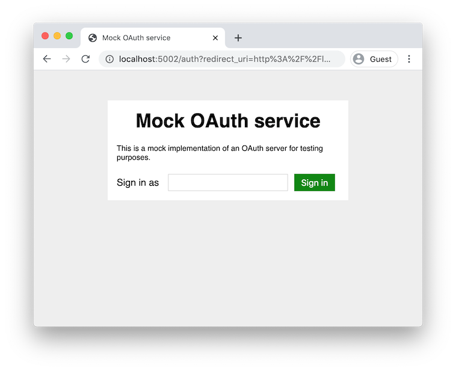

# Authentication Backend

Provides minimal backend functionality for integrating with external authentication providers.

This is for applications which need to identify returning users (e.g. to store user content), but do
_not_ need any user data from the authenticator (i.e. do not want personal details such as email
address, name, etc., or want any access to the authenticator's services on the user's behalf). The
output here is an opaque user ID which is guaranteed to uniquely identify a logged-in user.

When a user logs in via a provider, an access token is generated to check the user's ID with the
provider, then all information except the ID is thrown away (including the access token and any
refresh token that was granted). Even for providers which insist on sending some user PII (e.g.
Google always sends email address), this data is discarded immediately.

Currently supports Google, GitHub and GitLab. Note that each provider is separate, so if a user logs
in via GitHub on their first visit and Google on their second, they will appear as 2 different
users.

## Install dependency

```bash
npm install --save authentication-backend
```

## Usage

```javascript
import { randomUUID } from 'node:crypto';
import express from 'express';
import { buildAuthenticationBackend } from 'authentication-backend';

const config = {
  google: {
    clientId: 'my-google-client-id',
    authUrl: 'https://accounts.google.com/o/oauth2/auth',
    tokenInfoUrl: 'https://oauth2.googleapis.com/tokeninfo',
  },
  github: {
    clientId: 'my-github-client-id',
    clientSecret: 'my-github-client-secret',
    authUrl: 'https://github.com/login/oauth/authorize',
    accessTokenUrl: 'https://github.com/login/oauth/access_token',
    userUrl: 'https://api.github.com/user',
  },
  gitlab: {
    clientId: 'my-gitlab-client-id',
    authUrl: 'https://gitlab.com/oauth/authorize',
    tokenInfoUrl: 'https://gitlab.com/oauth/token/info',
  },
};

function tokenGranter(userId, service, externalId) {
  // database-based example:
  const myUserSessionToken = randomUUID();
  myDatabase.recordUserSession(myUserSessionToken, userId);
  return myUserSessionToken;
}

const auth = buildAuthenticationBackend(config, tokenGranter);
express().use('/my-prefix', auth.router).listen(8080);
```

You will need to do some work for each service on the client-side too, including some security
checks. See the source in `/example/static` for a reference implementation.

### Mock SSO server



This package also contains a mock SSO server, which can be run alongside your app (this is useful
for local development and testing):

<div style="clear: both"></div>

```javascript
import express from 'express';
import { buildAuthenticationBackend, buildMockSsoApp } from 'authentication-backend';

buildMockSsoApp().listen(9000);

const config =
  google: {
    clientId: 'my-google-client-id',
    authUrl: 'http://localhost:9000/auth',
    tokenInfoUrl: 'http://localhost:9000/tokeninfo',
  },
};

// ...

const auth = buildAuthenticationBackend(config, tokenGranter);
express()
  .use('/my-prefix', auth.router)
  .listen(8080);
```

## Authentication Providers

### Google sign in

You will need a Google client ID:

1. Go to <https://console.developers.google.com/apis>
2. Create a new project (if necessary)
3. In the "Credentials" screen, find the auto-generated OAuth client entry (if it was not created
   automatically, create one manually with "Create credentials" &rarr; "OAuth client ID")
4. Record the client ID (you will not need the client secret)
5. Update the authorised JavaScript origins to match your deployment. e.g. for local testing, this
   could be `http://localhost:8080`
6. Update the authorised redirect URIs to the same value, with `/<my-prefix>/google` appended to the
   end.
7. You may want to change the "Support email" listed under "OAuth consent screen", as this will be
   visible to users of your deployed app.

You can now configure the client ID in your app:

```javascript
const config =
  google: {
    clientId: 'something.apps.googleusercontent.com', // <-- replace
    authUrl: 'https://accounts.google.com/o/oauth2/auth',
    tokenInfoUrl: 'https://oauth2.googleapis.com/tokeninfo',
  },
};
```

### GitHub sign in

You will need a GitHub client ID:

1. Go to <https://github.com/settings/applications/new>
2. Set the "Homepage URL" to match your deployment. e.g. for local testing, this could be
   `http://localhost:8080`
3. Set the "Authorization callback URL" to the same value, with `/<my-prefix>/github` appended to
   the end.
4. Record the client ID and client secret.

You can now configure the client ID and secret in your app:

```javascript
const config =
  github: {
    clientId: 'my-github-client-id',         // <-- replace
    clientSecret: 'my-github-client-secret', // <-- replace
    authUrl: 'https://github.com/login/oauth/authorize',
    accessTokenUrl: 'https://github.com/login/oauth/access_token',
    userUrl: 'https://api.github.com/user',
  },
};
```

### GitLab sign in

GitLab
[can be used as an OAuth 2.0 provider with PKCE](https://docs.gitlab.com/integration/oauth_provider/).
You can set this up on self-hosted instances, and on gitlab.com.

You will need a GitLab client ID:

1. Go to <https://gitlab.com/-/user_settings/applications> and create an application
2. Set the "Redirect URI" to match your deployment with `/<my-prefix>/gitlab` appended to the end.
   e.g. for local testing, this could be `http://localhost:8080/<my-prefix>/gitlab`
3. Untick the "confidential" option and select the "email" scope (this is the closest we can get to
   no scopes)
4. Record the application ID (you will not need the secret).

You can now configure the application ID in your app:

```javascript
const config =
  gitlab: {
    clientId: 'my-gitlab-application-id', // <-- replace
    authUrl: 'https://gitlab.com/oauth/authorize',
    accessTokenUrl: 'https://gitlab.com/oauth/token',
    tokenInfoUrl: 'https://gitlab.com/oauth/token/info',
  },
};
```

## API

This expects you to create a frontend which handles the user interaction and some security checks,
and propagates returned data to the API.

### GET `/`

This will return the public parts of your config (i.e. `clientId` and `authUrl` for each service).

Example:

```json
{
  "google": {
    "clientId": "my-google-client-id",
    "authUrl": "https://accounts.google.com/o/oauth2/auth"
  },
  "github": {
    "clientId": "my-github-client-id",
    "authUrl": "https://github.com/login/oauth/authorize"
  },
  "gitlab": {
    "clientId": "my-gitlab-client-id",
    "authUrl": "https://gitlab.com/oauth/authorize"
  }
}
```

Any services which have not been configured will be omitted from the response.

### POST `/<service-name>`

Where `<service-name>` is `google`, `github` or `gitlab`.

This expects to receive JSON-encoded data:

```json
{
  "externalToken": "token-returned-by-service",
  "redirectUri": "the current page URL (excluding query string & hash)",
  "codeVerifier": "for PKCE flows, the code_verifier used when generating the code_challenge"
}
```

`redirectUri` and `codeVerifier` are currently only needed for GitLab.

It will check the token with the service, and if successful, will invoke the configured
`tokenGranter` function with a user ID, service name, and service user ID. The string returned by
`tokenGranter` will be sent to the user in a JSON response:

```json
{
  "userToken": "returned-token-granter-value"
}
```

If the check fails, an error will be returned instead, with a status code of 4xx or 5xx:

```json
{
  "error": "an error message"
}
```

## Security

The security guidance of [RFC9700](https://datatracker.ietf.org/doc/html/rfc9700) has been followed
where relevant. In particular this implementation is protected against:

- [4.4 Mix-Up Attacks](https://datatracker.ietf.org/doc/html/rfc9700#name-mix-up-defense-via-distinct)
- [4.5 Authorization Code Injection](https://datatracker.ietf.org/doc/html/rfc9700#name-pkce) for
  the GitLab integration
- [4.8 PKCE Downgrade Attack](https://datatracker.ietf.org/doc/html/rfc9700#name-pkce-downgrade-attack)

And the example client shows how to additionally protect against:

- [4.5 Authorization Code Injection](https://datatracker.ietf.org/doc/html/rfc9700#name-nonce) for
  all integrations
